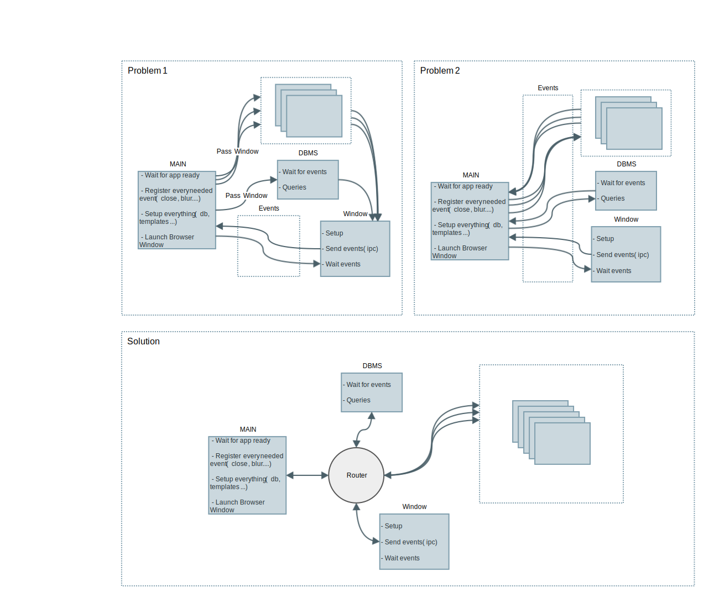

# ElectronRouter
Router solving Electron shell callback passing, helpfull for MVC

# Contents
- [Motivation](#motivation) 
- [Features](#features)
- [Examples](#examples)
- [Contributing](#contributing)
- [Future](#future)
- [Notes](#notes)

## Motivation
### The problem
When making an electron app I usually come down to the same problem: message passing; if you want to send a message to a window you have to keep a reference to it, whatever the module you're sending the message from, which leaves two possible solutions:
* Pass the wanted window object to every module that needs to send a message to that window.

or

* Somehow send the message to the owner of the window reference (usually implies callback passing).

On the other hand, when you want to receive a message from the window you have to listen to ipc which is usually great, but forces you to have perfect tune of the variables that the callback is going to access; this does not present a problem by itself, but as the application grows it may become one.

One example of this is when you have a database and want to query it from the window renderer process, either the database is listening on the ipc and aware of the window (keeps a reference to it) for querying/retrieving data or both the window and the database route their data through the main script, becoming some sort of dummy proxy.

After some brainstorming, the solution I came to was designing the Router, it gives similar options to [express](http://expressjs.com/). I've made a diagram to help visualize all this.



### The solution
The router just triggers the functions you register on by sending events and parameters. Allowing easy message/data passing and respecting the event/callback Electron architecture.

## Features
The router is just a simple instantiable object, just 'require' and instantiate it and start listening/sending events/data. By now it just have a few features. What this object does is route callbacks from one side to another passing parameters, triggered by different events.
It can listen to ipc events and send window events too.
HTTP Verbs are used just as different channels and for completness (equality to express)
For every route/event it is possible register wildcard ('*')

```
# Constructs the object setting its name and an optional window to send events to
Router.constructor( name, window )

# Triggers/Sends a message on the given event name passing provided messages.
Router.send( event, msg1, msg2... )

# Register a listener on the given event, triggering the callback when the event is sent. Callback receives the messages sent on the other side
Router.on( event, callback )

# Triggers/Sends a message to the given route with the given method (HTTP Verbs), passing to that verb/route handler the given messages. It's callback is called with err/result upon return of the handler
Router.route( route, method, msg1, msg2..., callback )

# Registers handler on method GET and the given route. Callback is called with req, res when that route is queried (triggered from route method)
Router.get( route, callback( req, res ) )

# Registers handler on method POST and the given route. Callback is called with req, res when that route is queried (triggered from route method)
Router.post( route, callback( req, res ) )

# Registers handler on method UPDATE and the given route. Callback is called with req, res when that route is queried (triggered from route method)
Router.update( route, callback( req, res ) )

# Registers handler on method DELETE and the given route. Callback is called with req, res when that route is queried (triggered from route method)
Router.delete( route, callback( req, res ) )

```

## Examples
For more examples, see [examples.js](examples.js).

```
// On every module that uses the router
// Import module
var Router = require('./router');

// Main script

var electron      = require('electron');
var app           = electron.app;
var BrowserWindow = electron.BrowserWindow;
var Router        = require('router');
var mainWindow    = null;
var router        = null;

...

app.on('ready', function() {

	// Create window
	... 

	// Instantiate
    router = new Router('MAIN', mainWindow);

    // Setup DB and modules
    ...

    // Do the rest on ready event (triggered from window, which is usaully the slowest component)
    router.on('ready', function(){
    	router.on('quit', function(){
    		// Close DB
    		// Handle quit code
    		...
    	})
    })
});

...

// Window script

var $ = require('jquery');
var Router = require('./router');
var router = null;

// On window ready
$(function(){
	// Instantiate
    router = new Router('WINDOW');
    // Send ready event to all registered handlers
    router.send('ready');
    ...

    $('#updates').on('click', function(){
    	router.route('/DB', 'POST', $('#userData').data())
    })
})

...

// DB script

var Router = require('./router');
var router = new Router('DB');

...

router.on('ready', function(){
	...
})

// Register trigger for every route on method GET
route.get('*', function( req, res ){
	db.find({ id: req.params }, function( err, results ){
		res.json( err, results );
	})
})

// Receive data on post method, route /DB
router.post('/DB', function( req, res ){
	console.log('Received', req.params);
	// Save data on db
	db.save( req.params, function( err, result ){
		// Send save result to the triggerer
		res.json( err, result );
	})
})

```

## Contributing
Any help is welcome, just send a pull request (please document a little what you want to do), with any ideas/code

## Future
In the future it could be great to support:
* MVC frameworks integration (Backbone...) (Should not be too difficult, overwrite sync method on Collections)
* Template rendering (i.e.: ```res.render(data)```)

## Notes
The diagram was made with [gliffy](https://www.gliffy.com/)
